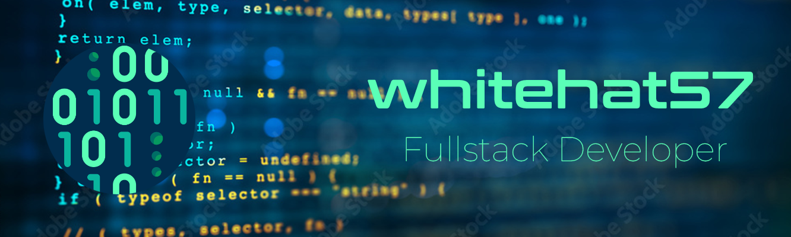

# 👨‍💻 Cybersecurity Enthusiast & Full-Stack Developer

## 🛡️ About Me

I'm a passionate cybersecurity enthusiast and Red Team developer with a strong commitment to digital security and freedom. By day, I work as a graphic designer and web developer, while dedicating my free time to bug hunting and security research.

## 🔧 Technical Skills

### 💻 Programming Languages
- Python
- Golang

### 🌐 Operating Systems
- Windows
- Debian
- Ubuntu
- Kali Linux
- Parrot OS
- Fedora

### ☁️ Expertise
- Network Security & Infrastructure
- Cloud Infrastructure
- AI Prompt Engineering
- Red Team Development
- Bug Hunting
- Web Development
- Graphic Design

## 🎯 Current Focus
- Actively participating in bug bounty programs
- Developing security tools and automation scripts
- Supporting digital freedom and privacy rights
- Expanding knowledge in cloud security

## 🌟 Interests
- Cybersecurity Research
- Ethical Hacking
- Digital Freedom Advocacy
- Cloud Security
- AI & Machine Learning

## 📫 Connect With Me
Feel free to reach out for collaboration on security projects or discussions about cybersecurity!

---
*"Security is not a product, but a process." - Bruce Schneier*